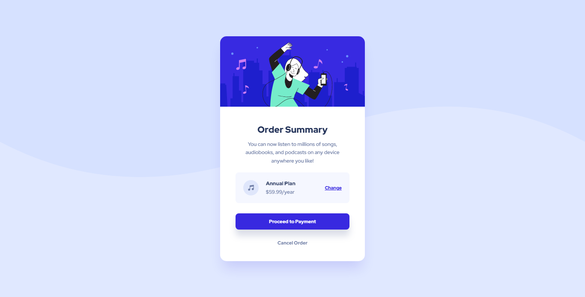

# Frontend Mentor - Order summary card solution

This is a solution to the [Order summary card challenge on Frontend Mentor](https://www.frontendmentor.io/challenges/order-summary-component-QlPmajDUj). Frontend Mentor challenges help you improve your coding skills by building realistic projects.

## Overview

### The challenge

Users should be able to:

- View the optimal layout depending on their device's screen size
- See hover states for interactive elements

### Screenshot

### Links

- Live Site URL: [NFT preview card](https://iranadryan.github.io/fe-mentor-order-summary/)

### Built with

- HTML
- CSS
- Flexbox

## Author

- Frontend Mentor - [@iranadryan](https://www.frontendmentor.io/profile/iranadryan)
- LinkedIn - [iranbatista](https://www.linkedin.com/in/iranbatista/)